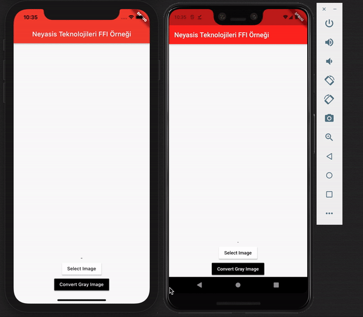

# Flutter FFI OpenCV Example

  We used dart FFI package in this project and this project about medium <a href="https://medium.com/@muhammed.almaz/flutter-projelerinde-dart-ffi-kullanarak-opencv-k%C3%BCt%C3%BCphanesini-kullanmak-62328fd29eb4">article</a>.

